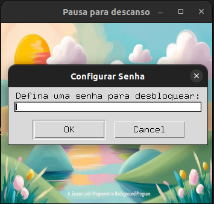
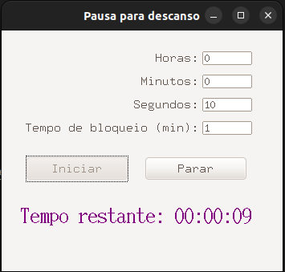
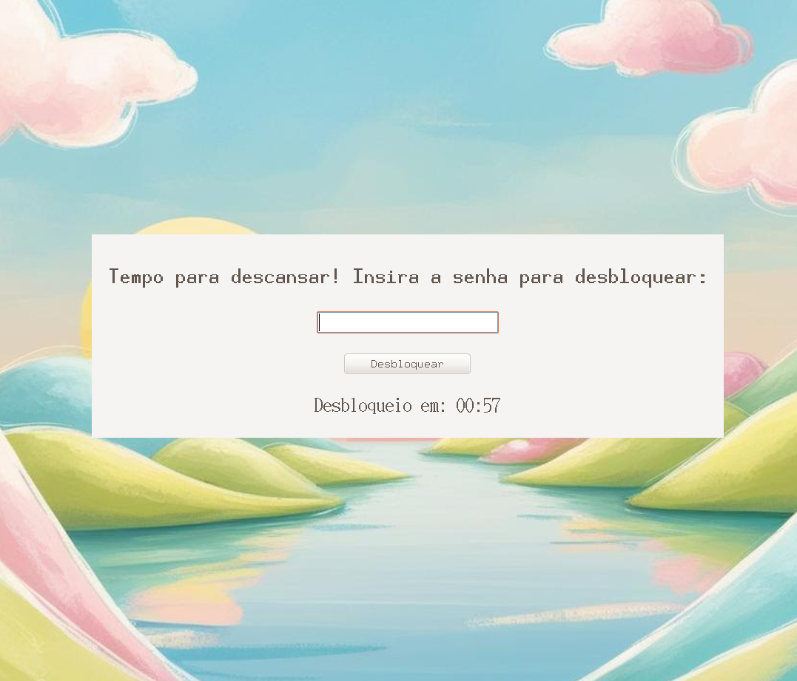

# ⏳ Contagem Regressiva com Bloqueio de Tela

Uma aplicação Python com interface gráfica que permite configurar uma contagem regressiva personalizada. Ao término do tempo, a tela é bloqueada e só pode ser desbloqueada com uma senha definida pelo usuário. Ideal para pausas, foco, produtividade ou controle de tempo em ambientes compartilhados.


## 🚀 Funcionalidades

- ⏱️ Entrada de tempo em horas, minutos e segundos.
- 🔒 Definição de tempo de bloqueio automático.
- 🔐 Tela de bloqueio com senha personalizada.
- 🔔 Alerta sonoro ao final da contagem e do bloqueio.
- 🎨 Interface agradável com tema e imagem de fundo.
- 📏 Redimensionável, com fundo que se adapta ao tamanho da janela.
- 📦 Empacotável como executável `.exe` para Windows (via PyInstaller).

---

## 🖼️ Imagem das Telas

   

<div align="center">
  
</div>
  


---

## 🛠️ Como usar

1. Clone ou baixe este repositório:
   ```bash
   git clone https://github.com/seunome/contagem_regressiva.git
   cd contagem_regressiva
   ```

2. Instale as dependências:
```pip install -r requirements.txt``

3. Execute a aplicação:
```python countdown.py```

## 📋 Requisitos

    Python 3.8+

    Pillow

    ttkthemes

    playsound (para sistemas não Windows)

## 👨‍💻 Autor

Desenvolvido com 💙 por Bruno Reche.
Entre em contato ou contribua com melhorias via Pull Requests!